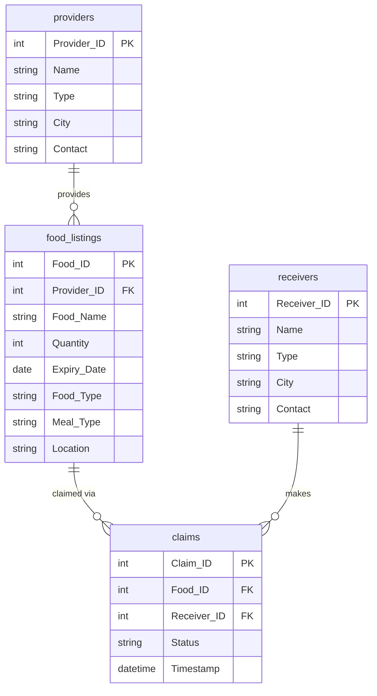

<div align="center">

# 🍱 Local Food Wastage Management System

<br>
<p><em>A data-driven platform to reduce local food wastage — bridging the gap between surplus and scarcity.</em></p>

<a href="#">
  
</a>
&nbsp;
<a href="https://github.com/pritwrk/food-wastage-management">
  
</a>

<br><br>


</div>

---

## 📖 Project Overview

> **Goal:** Build a complete food wastage management system that connects surplus food providers with receivers in need — powered by SQL analysis and an interactive Streamlit application.

Food wastage is a critical issue — restaurants and households discard surplus food while millions struggle with food insecurity. This project addresses that gap by creating a structured, data-driven platform where:

- 🏪 **Providers** (restaurants, supermarkets, grocery stores) list surplus food
- 🤝 **Receivers** (NGOs, shelters, individuals) discover and claim available food
- 📊 **Analysts** track trends, claim rates, and distribution patterns through SQL insights

---

## 🗄️ Database Schema



**Relationships:**
- `providers` — 1:N → `food_listings` &nbsp;*(one provider lists many food items)*
- `food_listings` — 1:N → `claims` &nbsp;*(one listing can have multiple claims)*
- `receivers` — 1:N → `claims` &nbsp;*(one receiver can make multiple claims)*

---

## ✨ Application Features

<details>
<summary><b>📊 Dashboard — KPI Metrics & Visual Analytics</b></summary>
<br>

- Total Providers, Receivers, Food Listings, Claims — live KPI cards
- **Claims Status Distribution** — Pie chart (Completed / Pending / Cancelled)
- **Food Type Distribution** — Bar chart (Vegetarian / Non-Vegetarian / Vegan)
- **Total Food Quantity by Provider Type** — Comparative bar chart

</details>

<details>
<summary><b>🔍 SQL Queries — 15 Business Intelligence Reports</b></summary>
<br>

- Dropdown selection for all 15 queries
- Live results displayed as interactive dataframes
- Covers provider analysis, claim trends, city-wise distribution & more

</details>

<details>
<summary><b>🥗 Food Listings — Smart Filter Search</b></summary>
<br>

- Filter by **City**, **Food Type**, **Meal Type** simultaneously
- Displays Provider contact details inline
- Real-time filtered results from MySQL

</details>

<details>
<summary><b>📋 CRUD Operations — Full Data Management</b></summary>
<br>

- **Add** new food listings with complete details
- **Update** existing listings (quantity, expiry, food type)
- **Delete** listings by Food ID with confirmation warning

</details>

<details>
<summary><b>📞 Provider & Receiver Directory</b></summary>
<br>

- Searchable contact directory for both providers and receivers
- Filter by City and Type
- Direct contact information for coordination

</details>

---

## 📊 SQL Business Analysis — 15 Queries

| # | Business Question | SQL Technique |
|---|---|---|
| 1 | Providers & receivers count per city | `GROUP BY`, `COUNT` |
| 2 | Provider type with most food contributions | `GROUP BY`, `ORDER BY DESC` |
| 3 | Contact info of providers in specific city | `WHERE` filter |
| 4 | Top 10 receivers by claim count | `JOIN`, `GROUP BY`, `LIMIT` |
| 5 | Total food quantity available | `SUM` aggregation |
| 6 | City with highest food listings | `GROUP BY`, `COUNT` |
| 7 | Most common food types | `GROUP BY`, `COUNT` |
| 8 | Claims per food item | `JOIN`, `GROUP BY` |
| 9 | Top providers by successful claims | 3-table `JOIN`, `WHERE Status` |
| 10 | Claims status percentage breakdown | `CASE WHEN`, percentage calc |
| 11 | Average quantity claimed per receiver | `AVG`, `JOIN` |
| 12 | Most claimed meal type | `JOIN`, `GROUP BY` |
| 13 | Total quantity donated per provider | `JOIN`, `SUM`, `GROUP BY` |
| 14 | Expiry-based urgent food tracking | `BETWEEN`, `DATE_ADD` |
| 15 | City-wise claim success rate | `CASE WHEN`, `ROUND`, `JOIN` |

---

## 🚀 How to Run Locally

```bash
# Step 1 — Clone the repository
git clone https://github.com/pritwrk/food-wastage-management.git
cd food-wastage-management

# Step 2 — Install dependencies
pip install -r requirements.txt

# Step 3 — Configure MySQL credentials in app.py
# Update: host, user, password, database name

# Step 4 — Launch the app
streamlit run app.py
```

---

## 📂 Repository Structure

```
food-wastage-management/
│
├── 📄 app.py               ← Streamlit application
├── 📄 requirements.txt     ← Python dependencies
└── 📄 README.md            ← Project documentation
```

---

## 🌐 Live Demo

> 🔗 **Live link will be updated here after Streamlit Cloud deployment**

---

<div align="center">

<a href="https://github.com/pritwrk">
  
</a>
&nbsp;
<a href="https://linkedin.com/in/pritam-verma-02721531a">
  
</a>

<br><br>
<sub>Built with ❤️ by <a href="https://github.com/pritwrk"><b>Pritam Verma</b></a></sub>

</div>
